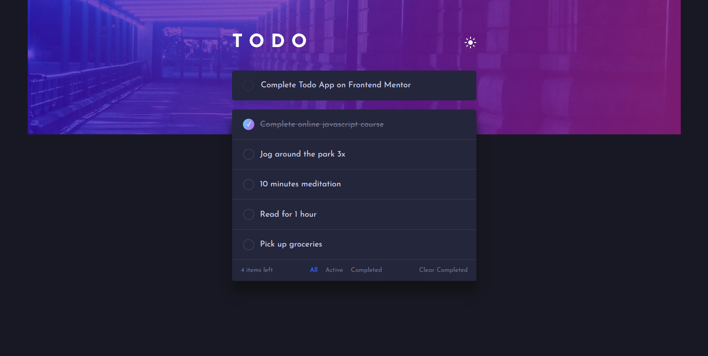

# Frontend Mentor - Todo app solution

This is a solution to the [Todo app challenge on Frontend Mentor](https://www.frontendmentor.io/challenges/todo-app-Su1_KokOW). Frontend Mentor challenges help you improve your coding skills by building realistic projects. 

## Table of contents

- [Overview](#overview)
  - [The challenge](#the-challenge)
  - [Screenshot](#screenshot)
  - [Links](#links)
- [My process](#my-process)
  - [Built with](#built-with)
  - [What I learned](#what-i-learned)
  - [Continued development](#continued-development)
- [Author](#author)

**Note: Delete this note and update the table of contents based on what sections you keep.**

## Overview

### The challenge

Users should be able to:

- View the optimal layout for the app depending on their device's screen size
- See hover states for all interactive elements on the page
- Add new todos to the list
- Mark todos as complete
- Delete todos from the list
- Filter by all/active/complete todos
- Clear all completed todos
- Toggle light and dark mode
- **Bonus**: Drag and drop to reorder items on the list

### Screenshot




### Links

- Solution URL: [Add solution URL here](https://your-solution-url.com)
- Live Site URL: [https://amaefula-joel.github.io/todo-app/](https://amaefula-joel.github.io/todo-app/)

## My process

### Built with

- Semantic HTML5 markup
- CSS custom properties
- Flexbox
- CSS Grid
- Mobile-first workflow
- JavaScript
- JQuery


### What I learned

I learned a lot from this challenge. 
- Using my custom attributes in helped a lot in changing the theme of the page

``` html
<body web-theme="light"> </body>
```
``` css
body[web-theme="light"] element{
    color : black
}
```

- Also helped me to sharpen my skills with Javasccript DOM

- Experimented on using Javascript local session storage to save the prefered theme of the user when they come back to the site

``` js 
function getTheme() {
    if (!(localStorage.getItem("userTheme") === null)) {
        body.attr("web-theme", localStorage.getItem("userTheme"));

        /* changes the icon theme icon to match the stored theme */
        if (localStorage.getItem("userTheme") === "light") {
            $("#theme-btn img").attr("src", "images/icon-moon.svg");
        } else {
            $("#theme-btn img").attr("src", "images/icon-sun.svg");
        }
    } else {
        localStorage.setItem("userTheme", body.attr("web-theme"));
    }
}
```


### Continued development

Noticed that the more my javascript code becomes the more confused i become on what to write next. I'll like to be more organized in my script code, so any larger projects i have in the future will be understandable by under developers


## Author

- Frontend Mentor - [@yourusername](https://www.frontendmentor.io/profile/Amaefula-joel)